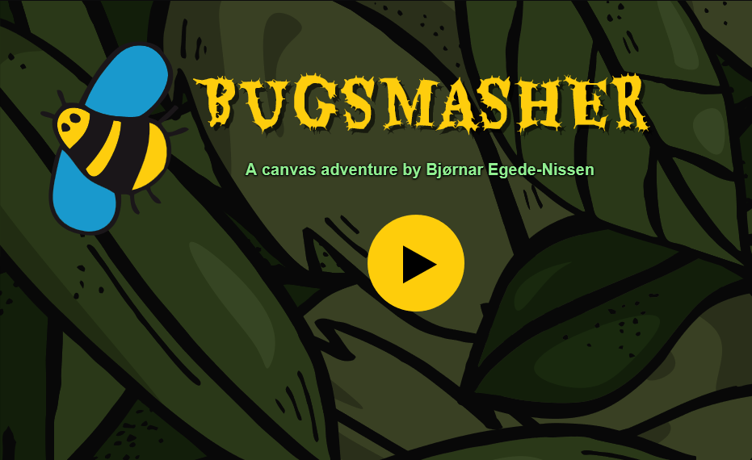

# BugSmasher - A Canvas Adventure 🪲

A simple game created for a Javascript class at Centennial College.

## Main Features

* The bug hops randomly around the game area at a given interval
* The player tries to catch the bug by clicking on it
* If he succeeds, the score is incremented
* The hopping interval is decremented by a number of milliseconds, so it gets harder to catch the bug.
* If the game becomes too challenging, the payer can reset the speed to the initial hopping interval by clicking the Reset Speed button.
* If the player wants, he can start again by resetting the score by clicking the Reset Score button.

## Additional Features

* Easily configurable (👉settings.json)
* Also counts misses
* The game will end after a certain number of misses (20) or rounds (50)
* The interval between hops decreases as the game progresses, so less progress is won, but the game will also last longer
* Mouse-over grace period: if the mouse hovers over the bug, it will be delayed to ensure there is enough time hit it

## Configuration

Edit`settings.json` in the base folder.

| Key | Default value | Description |
|----|----|----|
| bugScaleFactor | 0.08 | Scaling factor (size) of the bug - fraction of visible screen width+height |
| baseInterval | 2000 | Initial delay between bug jumps, in milliseconds |
| speedStep | 100 | Initial reduction-per-hit in the interval between jumps, in milliseconds |
| maxRounds | 100 | How many rounds (jumps) the game will last |
| maxMisses | 30 | How many times you can miss before game over |

## Credits

SVG graphics:

* Bee: <https://pixabay.com/vectors/animals-insects-butterfly-nature-4936355/>
* Background: <https://pixabay.com/vectors/leaves-foliage-tree-nature-autumn-6824098/>

## License

MIT
